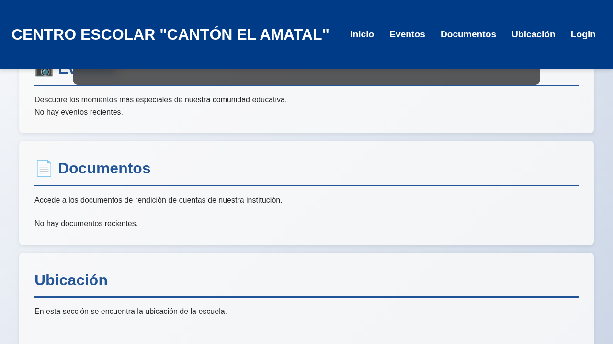
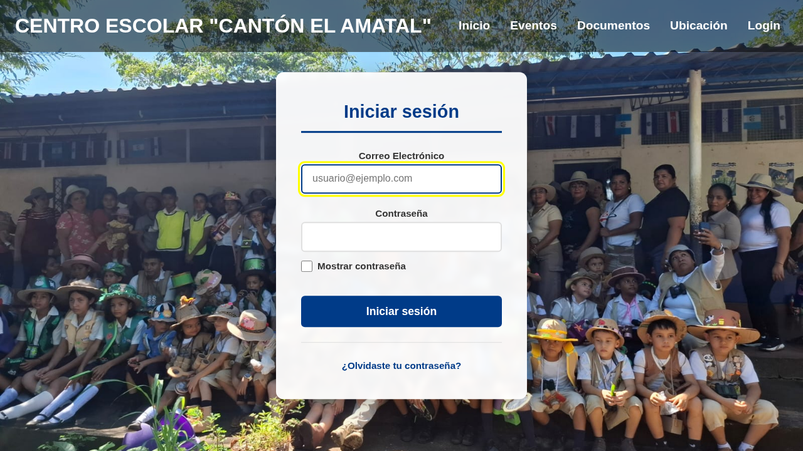
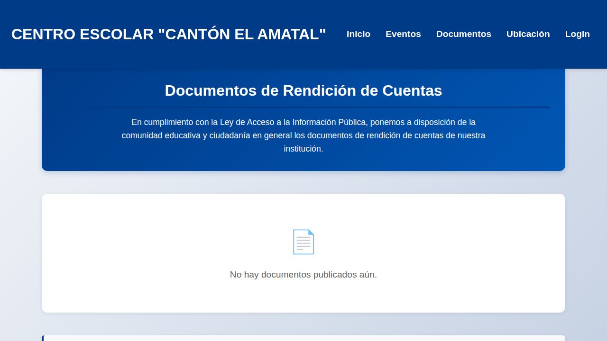

# 🏫 Proyecto Escuela


Bienvenido a la documentación técnica del **Proyecto Escuela**. Esta aplicación web integral sirve como portal público para la comunidad educativa y como sistema de gestión de contenidos (CMS) para la administración de la institución.

El proyecto ha sido recientemente refactorizado siguiendo principios **SOLID** y una arquitectura de capas, y todo el código ha sido traducido íntegramente al **español** para facilitar su mantenimiento y comprensión por el equipo local.

---

## 📋 Tabla de Contenidos
1. [Visión General](#-visión-general)
2. [Arquitectura del Sistema](#-arquitectura-del-sistema)
3. [Stack Tecnológico](#-stack-tecnológico)
4. [Estructura de Directorios](#-estructura-de-directorios)
5. [Esquema de Base de Datos](#-esquema-de-base-de-datos)
6. [Comunicación API y AJAX](#-comunicación-api-y-ajax)
7. [Instalación y Configuración](#-instalación-y-configuración)
8. [Seguridad](#-seguridad)
9. [Autores y Licencia](#-autores-y-licencia)

---

## 📸 Capturas de Pantalla
Para asegurar la calidad visual y la correcta traducción, se han generado capturas de las vistas principales:

| Inicio | Login | Documentos |
| :---: | :---: | :---: |
|  |  |  |

---

## 🔭 Visión General
El sistema permite a la escuela mantener a los padres y alumnos informados sobre eventos y circulares, mientras ofrece a la dirección herramientas sencillas para actualizar este contenido sin necesidad de tocar código.

*   **Público:** Visualización de galerías de fotos de eventos y descarga de documentos PDF (circulares, avisos).
*   **Administrativo:** Panel protegido para la subida masiva de fotos, gestión de documentos y administración de seguridad.

---

## 🏗 Arquitectura del Sistema
El proyecto sigue una arquitectura **Cliente-Servidor** desacoplada. El backend utiliza una **Arquitectura de Capas** con Inyección de Dependencias:

*   **Cliente (Frontend):** Single Page Application (SPA) moderna construida con **Vue.js 3** y **Vite**.
*   **Servidor (Backend):** Aplicación **Node.js/Express** estructurada en:
    *   **Controladores:** Gestión de peticiones y respuestas HTTP.
    *   **Servicios:** Orquestación de la lógica de negocio.
    *   **Repositorios:** Abstracción del acceso a datos (SQLite).
    *   **Contenedor de Dependencias:** Gestión centralizada de instancias (`contenedor.js`).

---

## 💻 Stack Tecnológico

### Backend (Servidor)
*   **Runtime:** Node.js (v20+)
*   **Framework:** Express.js
*   **Base de Datos:** SQLite3 (Persistencia local simple)
*   **Autenticación:** JWT (JSON Web Tokens) y Bcryptjs para hashing de claves.
*   **Inyección de Dependencias:** Implementación nativa por constructor.

### Frontend (Cliente)
*   **Framework:** Vue.js 3 (Composition API)
*   **Tooling:** Vite (Compilación ultra rápida)
*   **Enrutamiento:** Vue Router (Navegación sin recarga)
*   **Comunicación:** AJAX (Fetch API encapsulada en `clienteApi.js`)

---

## 📂 Estructura de Directorios

```text
proyecto-escuela/
├── docs/                 # Documentación técnica detallada
├── private/              # BACKEND (Express + SQLite)
│   ├── ...
│   └── servidor.js       # Punto de entrada API
├── src/                  # FRONTEND (Vue.js 3)
│   ├── api/              # Cliente de API centralizado
│   ├── assets/           # Estilos CSS y recursos estáticos
│   ├── componentes/      # Componentes Vue reutilizables
│   ├── router/           # Configuración de Vue Router
│   ├── utilidades/       # Funciones de apoyo (Sanitización XSS)
│   ├── vistas/           # Páginas completas (Home, Eventos, Admin, etc.)
│   ├── App.vue           # Componente raíz
│   └── main.js           # Inicialización de Vue
├── public/               # Archivos estáticos heredados y assets públicos
├── index.html            # Punto de entrada de Vite
└── vite.config.js        # Configuración de Vite
```

---

## 🗄 Esquema de Base de Datos
Aunque la lógica del sistema está en español, la base de datos utiliza identificadores técnicos en inglés por convención de desarrollo inicial.

### 1. `users` (Administradores)
*   `id`: Identificador único (Auto-incremental).
*   `user`: Correo electrónico/Nombre de usuario.
*   `hash`: Contraseña encriptada.
*   `created_at`: Fecha de creación.

### 2. `albums` (Galerías)
*   `id`: Identificador único (Slug).
*   `titulo`: Título del álbum.
*   `fecha`: Fecha del evento.
*   `descripcion`: Breve reseña.
*   `fotos`: Lista de archivos (Formato JSON).
*   `uploaded_at`: Fecha de subida.

### 3. `docs` (Circulares y Documentos)
*   `id`: Identificador único.
*   `titulo`: Nombre descriptivo del PDF.
*   `mes`: Mes correspondiente para filtrado.
*   `filename`: Nombre del archivo en el sistema.

### 4. `password_resets` (Recuperación)
*   `user_email`: Correo del usuario.
*   `token`: Token único temporal.
*   `expires_at`: Timestamp de expiración.

---

## 🔌 Comunicación API y AJAX
La interacción entre el frontend y el backend se realiza mediante una **API REST** que intercambia datos en formato **JSON**.

### El Cliente de API (`clienteApi.js`)
Para facilitar el aprendizaje, el proyecto utiliza un objeto centralizado que encapsula las llamadas al servidor.

1.  **Reactividad:** Vue.js gestiona automáticamente la actualización de la interfaz cuando los datos cambian.
2.  **Fetch API (AJAX Moderno):** Se usa para la mayoría de las operaciones.
3.  **XMLHttpRequest (AJAX Clásico):** Se mantiene para la función `subir()` debido a su capacidad nativa de rastrear el progreso de subida.

### Principales Endpoints
*   `POST /api/entrar`: Inicio de sesión.
*   `GET /api/albumes`: Listado de galerías.
*   `POST /api/albumes`: Creación de álbum (Requiere Token).
*   `GET /api/documentos`: Listado de PDFs.
*   `DELETE /api/documentos/:id`: Eliminación (Requiere Token).

---

## ⚙️ Instalación y Configuración
Para poner en marcha el proyecto localmente:

1.  Instalar dependencias: `npm run instalar-todo`
2.  Configurar variables de entorno en el archivo `.env`.
3.  Iniciar el servidor: `npm start`
4.  Acceder a `http://localhost:4000`.

---

## ✍️ Autores y Licencia
Este proyecto es de código abierto bajo la licencia **MIT**.
